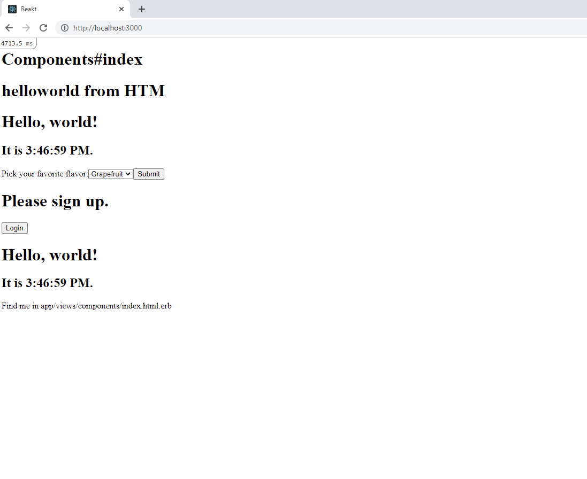

# This follows the DHH YouTube tutorial on setting up Rails 7 with React without Webpack using HTM

Youtube video here:
[Alpha preview: Using React with importmaps on Rails 7](https://youtu.be/k73LKxim6tw)

